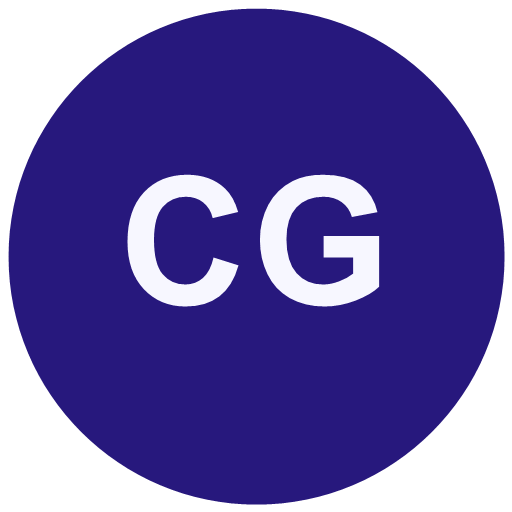

<div align="center">

<a href="https://codegurex.com/">
  
</a>

# CodeGurex

### SEO Técnico · Seguridad Web · Performance

Auditorías técnicas e implementación para una web visible, rápida y protegida.

[](https://codegurex.com/)
[](mailto:contacto@codegurex.com)
[](https://wa.me/593963223403)

</div>

---

## Qué es CodeGurex

**CodeGurex** es una empresa técnica de Ecuador que trabaja completamente en línea. Nos especializamos en detectar, priorizar y corregir los problemas que limitan la visibilidad, el rendimiento y la seguridad de un sitio web.

Nuestro trabajo parte de evidencia verificable: analizamos la implementación, explicamos el impacto de cada hallazgo y entregamos acciones concretas. Cuando una corrección necesita desarrollo, integración o reconstrucción, también podemos implementarla.

## Qué resolvemos

| Área | Qué analizamos |
| --- | --- |
| **Auditoría técnica web** | Estado general del sitio, hallazgos, severidad, impacto y prioridades. |
| **SEO técnico** | Rastreo, indexación, metadatos, arquitectura, enlazado y señales para buscadores. |
| **Rendimiento** | Core Web Vitals, carga, recursos, imágenes, JavaScript y experiencia móvil. |
| **Seguridad web** | Exposición, configuración, encabezados, dependencias y superficie de ataque. |
| **Infraestructura** | DNS, HTTPS, hosting, caché, disponibilidad y configuración de despliegue. |
| **Implementación** | Correcciones técnicas y desarrollo cuando el diagnóstico requiere intervenir el producto. |

## Cómo trabajamos

```text
01 · Auditamos
02 · Detectamos
03 · Priorizamos
04 · Implementamos
05 · Monitoreamos
```

Cada hallazgo se presenta con:

- evidencia y contexto técnico;
- nivel de severidad;
- impacto real en el negocio o en los usuarios;
- acción correctiva recomendada;
- orden de ejecución.

## Principios

- **Evidencia antes que opinión.** Las recomendaciones deben poder comprobarse.
- **Prioridad antes que volumen.** Un informe útil distingue lo urgente de lo accesorio.
- **Seguridad desde la base.** No se trata como un complemento final.
- **Transparencia.** No prometemos posiciones garantizadas ni resultados imposibles de verificar.
- **Implementación responsable.** Corregimos cuando el problema requiere cambios técnicos reales.

## Capacidades técnicas

<div align="center">


</div>

## Enfoque de los proyectos

El desarrollo sigue siendo una capacidad de CodeGurex, pero no es una solución automática para todo. Primero identificamos el problema; después elegimos la intervención técnica adecuada.

Nuestro trabajo puede incluir:

- corrección de errores de rastreo e indexación;
- optimización de carga y experiencia móvil;
- fortalecimiento de configuraciones y controles de seguridad;
- mejoras de arquitectura y mantenibilidad;
- integración, automatización o reconstrucción cuando está justificado.

## Contacto

¿Tu sitio pierde visibilidad, carga lento o presenta riesgos técnicos? Podemos revisarlo y decirte qué corregir primero.

- **Web:** [codegurex.com](https://codegurex.com/)
- **Email:** [contacto@codegurex.com](mailto:contacto@codegurex.com)
- **WhatsApp:** [+593 96 322 3403](https://wa.me/593963223403)
- **Ubicación:** Ecuador · Atención completamente en línea

---

<div align="center">

**CodeGurex — diagnóstico técnico, prioridades claras e implementación responsable.**

</div>
